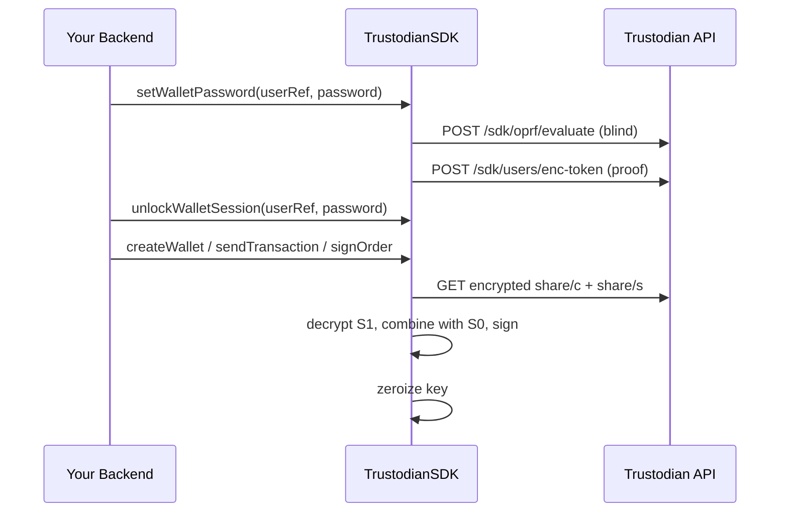

## Overview

`TrustodianSDK` v2 uses **2-of-3 Shamir's Secret Sharing** with **encrypted** server/recovery shares. The backend never stores a complete private key. The integrator persists the **device share (S0)** via `IntegratorShareStore`.

<Info>
  This differs from the Trustodian web app (iframe + IndexedDB). Server-side integrators **must**
  implement `shareStore` and manage wallet-password sessions explicitly.
</Info>

## The Three Shares

| Share | Stored by | Encrypted? |
| :--- | :--- | :--- |
| **Device (S0)** | Integrator (`shareStore`) | Your responsibility |
| **Server (S1)** | Trustodian API | AES-GCM with key1 (OPRF-derived from wallet password) |
| **Recovery (S2)** | Trustodian crypto service | AES-GCM with key2 + Vault Transit |

Reconstruction happens **in the SDK process**, in memory, only for signing — then the key is zeroized.

## Client environments

Encrypted server shares are stored **per client environment**: `web` (dashboard / browser app), `mobile`, `extension`, and `sdk` (server-side API integrations).

| Environment | Typical use |
| ----------- | ----------- |
| `web` | Trustodian web app, browser extension iframe |
| `mobile` | Native mobile apps |
| `extension` | Browser extension |
| `sdk` | **Your backend** via `vaults-multichain-sdk` |

When you use `TrustodianSDK`, every request is tagged as the **`sdk`** environment automatically. Shares created through the SDK integration are **separate** from shares created in the web dashboard for the same account — they do not mix.

<Info>
  If a user also uses the Trustodian web app, they need a **wallet password and device share for each environment** they use. Your integration only manages the `sdk` partition via `shareStore`.
</Info>

## IntegratorShareStore

Implement persistence for device shares:

```typescript
import type { IntegratorShareStore, DeviceShareRecord } from 'vaults-multichain-sdk';

class MyShareStore implements IntegratorShareStore {
  async save(record: DeviceShareRecord): Promise<void> { /* ... */ }
  async load(userRef: string, walletId: string): Promise<DeviceShareRecord | null> { /* ... */ }
  async findByAddress(
    userRef: string,
    chainType: string,
    address: string,
  ): Promise<DeviceShareRecord | null> { /* ... */ }
  async delete(userRef: string, walletId: string): Promise<void> { /* ... */ }
}
```

Each record includes the share bytes and a **version** (must match server share version after rotation).

For local dev only:

```typescript
import { InMemoryShareStore } from 'vaults-multichain-sdk';
```

## Wallet Password Flow



1. **`setWalletPassword`** — first-time setup: proves you know the password to the API (OPRF + enc-token)
2. **`unlockWalletSession`** — derive decryption keys in memory before each crypto session
3. Crypto operations — SDK fetches encrypted shares for the **`sdk`** environment, decrypts locally
4. **`lockWalletSession`** — clear session keys when done

The wallet password is **chosen by the integrator's user** (or your service policy). It is **not** the API key and **not** stored by Trustodian in plaintext. Without it, encrypted server shares cannot be decrypted.

## Wallet Creation Modes

Check deployment flag via `getAppConfig()` → `genWalletFromMnemonic`:

| Mode | When | SDK call |
| :--- | :--- | :--- |
| **Local generate** | `genWalletFromMnemonic: false` (default) | `createWallet({ mode: 'generate' })` |
| **ECDH from mnemonic** | `genWalletFromMnemonic: true` | `createWallet({ mode: 'ecdh' })` |

In both cases the SDK splits locally and posts **encrypted** S1/S2 only. The private key is never sent to the server.

```typescript
const userRef = await sdk.getSdkUserId();
await sdk.unlockWalletSession(userRef, password);

const { wallets } = await sdk.createWallet({
  chain: EChainType.EVM,
  userRef,
  password,
  mode: 'generate',
});
// S0 saved automatically to shareStore
```

If a device share is missing on a new server instance, pass `walletPassword` on the crypto method — the SDK runs recovery via `ensureWalletDeviceShare` / `recoverWallet`.

### Password change

```typescript
await sdk.changeWalletPassword(userRef, {
  currentPassword: oldPassword,
  newPassword,
});
```

Backend updates encrypted shares. Other environments recover on first crypto use.

### Explicit recovery

| Method | Use |
| ------ | --- |
| `recoverWallet` | Single wallet |
| `recoverWalletsBatch` | Batch before backup restore (`POST /sdk/wallets/recover-batch`) |
| `ensureWalletReadyForCrypto` | Per-wallet gate (called internally) |
| `rotateShares` | Manual re-split for one wallet |

## Organization Vault Activation Shares

Multisig vault create/activate on SOL/TRON/XRP encrypts an activation secret. The SDK handles this when you pass `userRef` / unlocked session to `createMultisig` and `activateMultisig`. See [Multisig](/sdk-guide/multisig) and [Organization](/sdk-guide/organization).

## Security Responsibilities

| Party | Responsibility |
| ----- | -------------- |
| **Trustodian** | One encrypted share; cannot spend without wallet password + second share |
| **Integrator** | `shareStore`, wallet password handling, API key on server only |

<Warning>
  Never log wallet passwords, device shares, or reconstructed private keys.
</Warning>

## FAQ

<AccordionGroup>
  <Accordion title="What is KeyMismatchError?">
    Device share version does not match server. The SDK attempts recovery when `walletPassword` is
    available; otherwise unlock and retry with password.
  </Accordion>
  <Accordion title="Why shareStore instead of automatic backend storage?">
    S0 must stay under integrator control for non-custodial B2B integrations. The web app uses
    iframe IndexedDB; the SDK uses your database.
  </Accordion>
</AccordionGroup>
