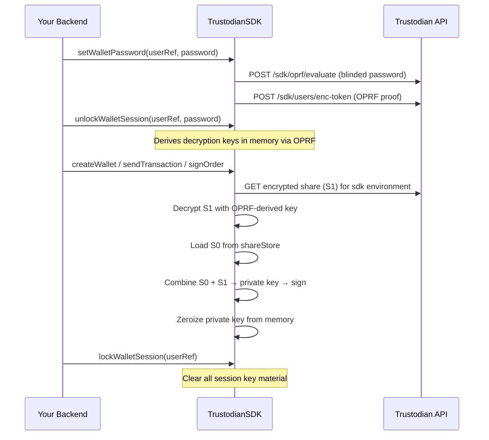

Key management is the foundation of the Cowchain SDK's security model. Understanding how shares are created, stored, and combined gives you the context you need to implement `shareStore` correctly, handle wallet-password sessions safely, and respond to errors like `KeyMismatchError` with confidence. This page covers the full picture: from the Shamir split at wallet creation to password change, explicit recovery, and the security responsibilities of each party.

## 2-of-3 Shamir's Secret Sharing Overview

When the SDK creates a wallet, the private key is immediately split into **three shares** using Shamir's Secret Sharing. The underlying math guarantees:

- **Any two shares reconstruct the key** — you can sign with S0 + S1 (normal flow) or S0 + S2 (recovery).
- **Any single share alone is useless** — possession of one share reveals nothing about the private key.
- **The reconstructed key exists only in memory, only for signing** — the SDK zeroizes it immediately after use.

Trustodian's servers hold only one encrypted share (S1). Even if that server were fully compromised, an attacker would still need your device share (S0) **and** the wallet password to decrypt and combine the shares. No one party — not Trustodian, not your backend, not an attacker who compromises either side alone — can spend funds unilaterally.

<Info>
  This architecture differs from the Trustodian web app, which uses an iframe and browser
  IndexedDB to store the device share. As a server-side integrator, you are responsible for
  implementing `IntegratorShareStore` and managing wallet-password sessions explicitly. The web
  app's shares and the SDK shares are in **separate partitions** and do not mix.
</Info>

## The Three Shares

| Share | Held by | Encryption at rest |
| --- | --- | --- |
| **Device share (S0)** | You, via `shareStore` | Your responsibility — treat as sensitive key material |
| **Server share (S1)** | Trustodian API | AES-GCM, key derived from wallet password via OPRF |
| **Recovery share (S2)** | Trustodian crypto service | AES-GCM with a second key + Vault Transit |

<Note>
  Reconstruction of the private key always happens **inside the SDK process, in memory**. After
  signing, the key is zeroized. Neither Trustodian's API servers nor your database ever hold the
  reconstructed key.
</Note>

## Client Environments

The Trustodian platform partitions encrypted server shares by client environment. Each environment maintains its own set of encrypted shares for the same underlying wallet:

| Environment | Typical use |
| --- | --- |
| `web` | Trustodian web app and browser extension iframe |
| `mobile` | Native mobile apps |
| `extension` | Browser extension |
| `sdk` | **Your backend** via `vaults-multichain-sdk` |

When you use `TrustodianSDK`, every request is automatically tagged as the `sdk` environment. Shares created through the SDK are separate from shares created in the web dashboard — if a user also accesses their account via the web app, they need a distinct wallet password and device share for each environment. Your integration manages only the `sdk` partition via `shareStore`.

## Implementing `IntegratorShareStore`

The `IntegratorShareStore` interface is how you give the SDK a durable home for device shares (S0). You must implement it for production — `InMemoryShareStore` is only suitable for local development because it resets on every process restart.

```typescript
import type { IntegratorShareStore, DeviceShareRecord } from 'vaults-multichain-sdk';

class MyShareStore implements IntegratorShareStore {
  /**
   * Persist a device share record after wallet creation or share rotation.
   * Called automatically by the SDK — you do not need to call this yourself.
   */
  async save(record: DeviceShareRecord): Promise<void> {
    await db.upsert('device_shares', {
      user_ref:  record.userRef,
      wallet_id: record.walletId,
      share:     record.share,    // Buffer — store as binary / base64
      version:   record.version,  // must match server share version after rotation
    });
  }

  /**
   * Retrieve a device share by (userRef, walletId).
   * Return null if no record exists yet.
   */
  async load(userRef: string, walletId: string): Promise<DeviceShareRecord | null> {
    return db.findOne('device_shares', { user_ref: userRef, wallet_id: walletId }) ?? null;
  }

  /**
   * Find a share by the wallet's on-chain address (used for send/sign flows
   * where only the address is known, not the internal wallet ID).
   */
  async findByAddress(
    userRef: string,
    chainType: string,
    address: string,
  ): Promise<DeviceShareRecord | null> {
    return db.findOne('device_shares', { user_ref: userRef, chain_type: chainType, address }) ?? null;
  }

  /**
   * Remove a device share record, e.g. when a wallet is deleted.
   */
  async delete(userRef: string, walletId: string): Promise<void> {
    await db.delete('device_shares', { user_ref: userRef, wallet_id: walletId });
  }
}
```

Each `DeviceShareRecord` includes the share bytes and a **version number** that the SDK uses to detect stale shares after a rotation. If the version in your store does not match the server, the SDK throws `KeyMismatchError` and attempts automatic recovery when a wallet password is available.

For local development and automated tests, use the built-in in-memory store:

```typescript
import { InMemoryShareStore } from 'vaults-multichain-sdk';

const sdk = new TrustodianSDK({
  apiKey: process.env.TRUSTODIAN_API_KEY!,
  network: 'testnet',
  shareStore: new InMemoryShareStore(),
});
```

<Warning>
  Never use `InMemoryShareStore` in production. If your process restarts, all device shares are
  lost and every wallet will need explicit recovery before it can be used.
</Warning>

## Wallet-Password Session Flow

The sequence below shows what happens from the moment you call `setWalletPassword` to the moment a transaction is signed and the key is cleared.



<Steps>
  <Step title="setWalletPassword — first-time setup">
    Runs the OPRF protocol with the Trustodian API to bind the wallet password cryptographically
    and register the encrypted session token. Call this exactly once per user per environment.

    ```typescript
    await sdk.setWalletPassword({
      userRef,
      password: walletPassword,
      passwordHint: 'optional hint for the user',
    });
    ```
  </Step>
  <Step title="unlockWalletSession — before each crypto session">
    Derives the in-memory decryption keys from the wallet password. Required before any method
    that reconstructs keys. The derived keys expire after `keyTtlMs` (default 5 minutes).

    ```typescript
    await sdk.unlockWalletSession(userRef, walletPassword);
    ```
  </Step>
  <Step title="Perform crypto operations">
    With the session unlocked, the SDK fetches the encrypted server share, decrypts it locally,
    combines it with the device share from `shareStore`, signs, and zeroizes.

    ```typescript
    const { wallets } = await sdk.createWallet({
      chain: EChainType.EVM,
      userRef,
      password: walletPassword,
      mode: 'generate',
    });
    // S0 is saved automatically to shareStore
    ```
  </Step>
  <Step title="lockWalletSession — when done">
    Explicitly clears all in-memory key material. Use a `try/finally` block to guarantee this runs
    even on error.

    ```typescript
    sdk.lockWalletSession(userRef);
    ```
  </Step>
</Steps>

<Warning>
  The wallet password is chosen by your user (or defined by your service policy). Trustodian never
  stores it in plaintext. Without the wallet password, the server share (S1) cannot be decrypted
  and no signing can occur. Treat the password with the same care as the device share itself.
</Warning>

## Wallet Creation Modes

Before creating wallets, check the deployment flag via `getAppConfig()` → `genWalletFromMnemonic` to determine which mode to use:

| Mode | When to use | `createWallet` call |
| --- | --- | --- |
| **Local generate** | `genWalletFromMnemonic: false` (default) | `mode: 'generate'` |
| **ECDH from mnemonic** | `genWalletFromMnemonic: true` | `mode: 'ecdh'` |

In both modes the private key is generated and split **locally inside the SDK**. Only the encrypted S1 and S2 shares are posted to the server — the private key itself is never transmitted.

```typescript
const userRef = await sdk.getSdkUserId();
await sdk.unlockWalletSession(userRef, password);

const { wallets } = await sdk.createWallet({
  chain: EChainType.EVM,
  userRef,
  password,
  mode: 'generate',
});
// Device share S0 is saved to shareStore automatically
console.log('Created wallet:', wallets[0].address);
```

<Tip>
  If a device share is missing — for example after migrating to a new server or restoring from
  backup — pass `walletPassword` on the crypto method call. The SDK will automatically invoke
  recovery to reconstruct and re-save S0 before proceeding.
</Tip>

## Changing the Wallet Password

To change the password, provide both the current and new passwords. The SDK re-encrypts the server shares with keys derived from the new password:

```typescript
await sdk.changeWalletPassword(userRef, {
  currentPassword: oldPassword,
  newPassword,
});
```

Other environments (web, mobile) automatically recover and re-encrypt their shares on their next crypto operation after a password change.

## Explicit Recovery Methods

In most cases recovery is handled automatically. The following methods are available when you need explicit control:

| Method | Use case |
| --- | --- |
| `recoverWallet(params)` | Recover device share for a single wallet |
| `recoverWalletsBatch(params)` | Batch recovery before restoring from backup (`POST /sdk/wallets/recover-batch`) |
| `ensureWalletReadyForCrypto(params)` | Per-wallet readiness gate (called internally by the SDK) |
| `rotateShares(params)` | Manually re-split shares for a single wallet |

## Organization Vault Activation Shares

When you create or activate a multisig vault on Solana, Tron, or XRP, the SDK encrypts an activation secret as part of the flow. This is handled automatically when you pass `userRef` and an unlocked session to `createMultisig` and `activateMultisig`. See [Multisig](/sdk-guide/multisig) and [Organization](/sdk-guide/organization) for details.

## Security Responsibilities

| Party | Responsibility |
| --- | --- |
| **Trustodian** | Stores one encrypted share (S1/S2); cannot spend funds without the wallet password and the device share |
| **You (integrator)** | Implements `shareStore` with durable, encrypted storage; keeps API key on the server; passes wallet passwords per-request only; never logs key material |

<Warning>
  Never log wallet passwords, device shares, or reconstructed private keys — not even in debug or
  development builds. If any of these values are ever written to a log aggregation service, treat
  them as potentially compromised and rotate immediately.
</Warning>

## FAQ

<AccordionGroup>
  <Accordion title="What is KeyMismatchError and how do I handle it?">
    `KeyMismatchError` means the version of the device share in your `shareStore` does not match
    the current version of the server share. This typically happens after a `rotateShares` or
    `changeWalletPassword` call that updated the server share but did not update `shareStore` (for
    example, if your process crashed mid-rotation).

    The SDK attempts automatic recovery when a `walletPassword` is available. To resolve it
    manually: unlock the session with the current wallet password and retry the operation — the SDK
    will invoke `ensureWalletReadyForCrypto` and update `shareStore` with the correct S0 version.
  </Accordion>
  <Accordion title="Why does the SDK use shareStore instead of storing S0 automatically?">
    For a non-custodial B2B integration, the device share must remain under the integrator's
    control — Trustodian must never be able to access it. The Trustodian web app stores S0 in
    browser IndexedDB inside an isolated iframe; the SDK delegates that responsibility to your
    database via `shareStore`. This design ensures that even if Trustodian's infrastructure were
    fully compromised, user funds would remain safe as long as the integrator's `shareStore` is
    secure.
  </Accordion>
  <Accordion title="What happens if my server restarts and I used InMemoryShareStore?">
    All in-memory device shares are lost. Any subsequent crypto operation will throw because S0
    is missing. You must run explicit recovery (`recoverWallet` or `recoverWalletsBatch`) with the
    wallet password to rebuild S0. This is why `InMemoryShareStore` must never be used in
    production — implement a database-backed `IntegratorShareStore` from the start.
  </Accordion>
  <Accordion title="Do I need a separate shareStore per environment (web, sdk, mobile)?">
    No. Your `shareStore` only manages the `sdk` environment partition. The web and mobile
    environments store their own device shares in browser IndexedDB and on-device storage
    respectively. They are fully independent and the SDK never reads or writes those partitions.
  </Accordion>
  <Accordion title="Can multiple users share one SDK instance?">
    Yes. The SDK is stateless between requests except for in-memory wallet-password sessions, which
    are keyed by `userRef`. You can create a single `TrustodianSDK` instance and use it across
    multiple concurrent requests as long as each request uses the correct `userRef` and calls
    `unlockWalletSession` and `lockWalletSession` appropriately (or uses `runWithUserRef` for async
    context propagation).
  </Accordion>
</AccordionGroup>
