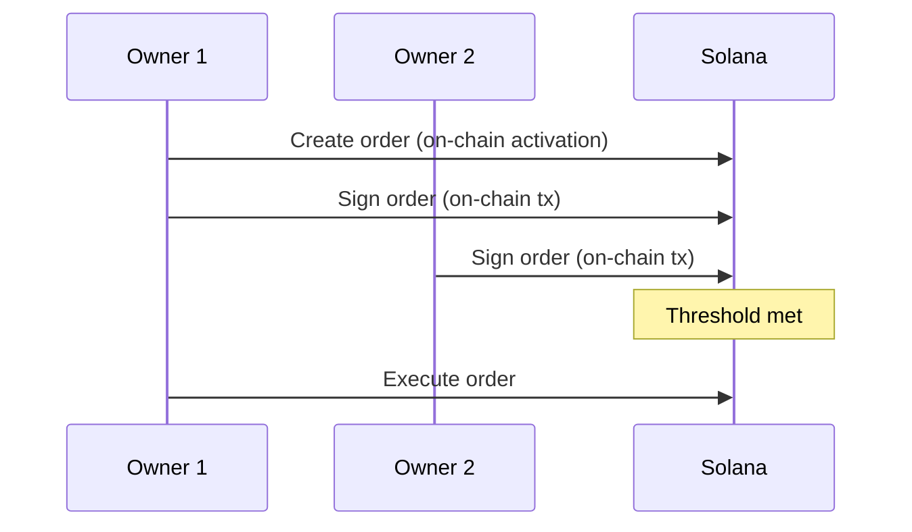
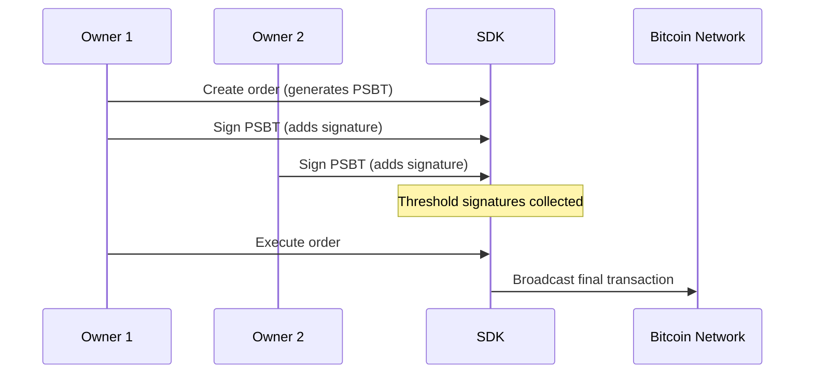
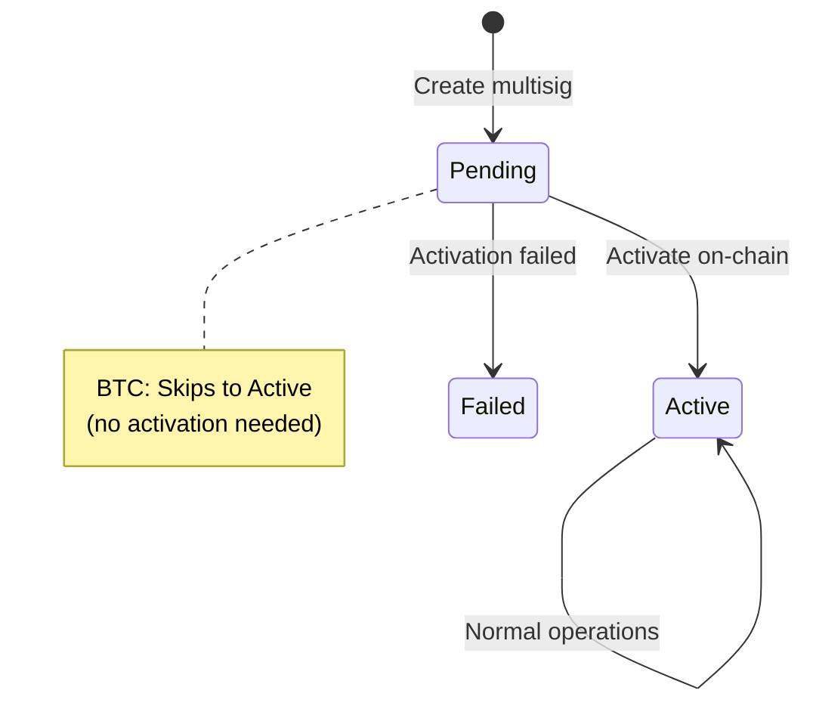

## Prerequisites

Multisig create, activate, and order flows require the same **v2 session** as personal wallets:

```typescript
const userRef = await sdk.getSdkUserId();
await sdk.unlockWalletSession(userRef, password);

const multisig = await sdk.createMultisig({
  chain: EChainType.EVM,
  owners: ['0x1111...', '0x2222...', '0x3333...'],
  threshold: 2,
  chainIds: ['1'], // EVM chain ids
  userRef,
  walletScope: 'personal', // or 'organization' for org vaults
});

// Rename after create (name is not set on create)
await sdk.updateMultisigName({
  chain: EChainType.EVM,
  multisigId: multisig.id,
  name: 'Team Treasury',
  walletAddress: creatorAddress,
});
```

Pass `userRef` (and unlocked session) to `activateMultisig`, `signOrder`, and `executeOrder`. For org vaults, set `walletScope: 'organization'`. See [Organization](/sdk-guide/organization).

## Overview

Multisig (multi-signature) wallets require multiple owner approvals before executing transactions. This adds an extra layer of security and enables shared custody of funds.

<Info>**Example**: A 2-of-3 multisig requires 2 out of 3 owners to approve any transaction.</Info>

## Supported Multisig Types

| Chain       | Implementation  | Activation             | Execution Fee Paid By | Settings Updates |
| ----------- | --------------- | ---------------------- | --------------------- | ---------------- |
| **EVM**     | Gnosis Safe     | On-chain (gas fee)     | Executor              | ✅ Supported     |
| **Solana**  | Squads V4       | On-chain (~0.0021 SOL) | Actor                 | ✅ Supported\*   |
| **Tron**    | Native Multisig | On-chain (100 TRX)     | Multisig Wallet       | ✅ Supported     |
| **Bitcoin** | P2WSH           | Not required           | Multisig Wallet       | ❌ Not available |
| **Cardano** | Native Scripts  | Not required           | Multisig Wallet       | ❌ Not available |
| **XRP**     | SignerList      | On-chain (1.2 XRP)     | Multisig Wallet       | ✅ Supported     |

### EVM (Gnosis Safe)

<Card title="Gnosis Safe" icon="ethereum">
  Smart contract multisig, widely used across all EVM chains.
</Card>

| Feature              | Details                                  |
| -------------------- | ---------------------------------------- |
| **Activation**       | Required. Deploys Safe contract on-chain |
| **Activation Cost**  | Gas fee (varies by network)              |
| **Signatures**       | Off-chain (EIP-712 typed data)           |
| **Settings Updates** | Add/remove owners, change threshold      |
| **Order Expiration** | No expiration                            |
| **Executor**         | Any owner after threshold met            |
| **Gas Payment**      | Paid by executor                         |

**Key Features:**

- Supports batched transactions
- Transaction simulation before execution
- Extensive ecosystem integrations

```typescript
// Create EVM Multisig
const multisig = await sdk.createMultisig({
  chain: EChainType.EVM,
  owners: ['0x1111...', '0x2222...', '0x3333...'],
  threshold: 2,
  chainIds: ['1'],
  userRef,
});

// Activate (deploys contract)
const result = await sdk.activateMultisig({
  chain: EChainType.EVM,
  multisigId: multisig.id,
  multisigAddress: multisig.address || '',
  walletAddress: myWalletAddress,
  multisig,
  userRef,
});
```

---

### Solana (Squads Protocol V4)

<Card title="Squads Protocol V4" icon="s">
  Native Solana program for multisig operations using vault PDAs.
</Card>

| Feature              | Details                                    |
| -------------------- | ------------------------------------------ |
| **Activation**       | Required. Creates on-chain accounts        |
| **Activation Cost**  | ~0.0021 SOL (rent-exempt minimum)          |
| **Signatures**       | On-chain (each signature is a transaction) |
| **Settings Updates** | Add/remove owners, change threshold        |
| **Order Expiration** | No time expiration                         |
| **Special Behavior** | Orders auto-activate on creation           |

<Warning>
  **Important**: When a settings update order (add/remove owner, change threshold) is executed,
  **all currently pending orders become expired** and can no longer be executed.
</Warning>

**Key Features:**

- Vault PDA holds all funds securely
- Each proposal has a unique transaction index
- Signatures are recorded on-chain immediately
- Requires rent-exempt SOL for account creation

```typescript
// Create Solana Multisig
const multisig = await sdk.createMultisig({
  chain: 'SOL',
  owners: ['pubkey1...', 'pubkey2...', 'pubkey3...'],
  threshold: 2,
  userRef,
});

// Activation required (~0.0021 SOL)
await sdk.activateMultisig({
  chain: 'SOL',
  multisigId: multisig.id,
  multisigAddress: multisig.address || '',
  walletAddress: myWalletAddress,
  feeQuote: await sdk.estimateActivationFee({ chain: 'SOL', multisigId: multisig.id }),
  multisig: multisig,
});
```

**Order Flow (Solana-specific):**



---

### Tron (Native Blockchain Multisig)

<Card title="Native Tron Multisig" icon="t">
  Uses Tron's native account permission system to convert regular accounts into multisig wallets.
</Card>

| Feature              | Details                                      |
| -------------------- | -------------------------------------------- |
| **Activation**       | Required. Converts account to multisig       |
| **Activation Cost**  | **100 TRX minimum balance required**         |
| **Signatures**       | Off-chain (collected before broadcast)       |
| **Settings Updates** | Add/remove owners, change threshold          |
| **Order Expiration** | **23 hours 50 minutes** from first signature |

<Warning>
  **Pre-activation requirement**: The multisig address must have at least **100 TRX** before
  activation can proceed.
</Warning>

<Warning>
  **Order Expiration**: Tron orders expire **23 hours 50 minutes** after the first signature. If not
  executed within this window, the order becomes `expired` and must be recreated.
</Warning>

**Key Features:**

- Native blockchain permission system (no smart contract)
- Supports TRX and all TRC-20 tokens
- Account is converted to multisig on activation
- Time-limited order validity

```typescript
// Create Tron Multisig
const multisig = await sdk.createMultisig({
  chain: 'TRON',
  owners: ['T...addr1', 'T...addr2', 'T...addr3'],
  threshold: 2,
  userRef,
});

// ⚠️ Ensure multisig address has 100+ TRX before activation!
await sdk.activateMultisig({
  chain: 'TRON',
  multisigId: multisig.id,
  multisigAddress: multisig.address || '',
  walletAddress: myWalletAddress,
  feeQuote: await sdk.estimateActivationFee({ chain: 'TRON', multisigId: multisig.id }),
  multisig: multisig,
});
```

---

### Bitcoin (P2WSH)

<Card title="P2WSH Native Multisig" icon="bitcoin">
  Native SegWit multisig using Pay-to-Witness-Script-Hash for lower fees.
</Card>

| Feature              | Details                 |
| -------------------- | ----------------------- |
| **Activation**       | **Not required**        |
| **Signatures**       | Off-chain (PSBT format) |
| **Settings Updates** | **Not available**       |
| **Order Expiration** | No expiration           |

<Info>
  Bitcoin multisig does not require activation. The multisig address is derived from all owner
  public keys and is immediately usable.
</Info>

<Warning>
  **Settings cannot be changed**: Once a Bitcoin multisig is created, you cannot add/remove owners
  or change the threshold. To change settings, you must create a new multisig and transfer funds.
</Warning>

**Key Features:**

- No activation transaction needed
- Uses PSBTs (Partially Signed Bitcoin Transactions)
- Each owner adds their signature to the PSBT
- Lower fees compared to legacy P2SH multisig
- Immediate availability after creation

```typescript
// Create Bitcoin Multisig (no activation needed!)
const multisig = await sdk.createMultisig({
  chain: 'BTC',
  owners: ['pubkey1...', 'pubkey2...', 'pubkey3...'],
  threshold: 2,
  userRef,
});

// Ready to use immediately - no activation step
console.log('Bitcoin multisig address:', multisig.address);
```

**PSBT Signing Flow:**



### Cardano (Native Scripts)

<Card title="Cardano Native Scripts" icon="eye">
  Uses native scripts to define spending conditions without Plutus smart contracts.
</Card>

| Feature              | Details               |
| -------------------- | --------------------- |
| **Activation**       | **Not required**      |
| **Signatures**       | Off-chain (Witnesses) |
| **Settings Updates** | **Not available**     |
| **Order Expiration** | **72 hours** (TTL)    |
| **Asset Support**    | ADA, USDM             |

<Info>
  Like Bitcoin, Cardano multisig settings cannot be changed after creation. You must create a new
  multisig address and transfer funds.
</Info>

**Key Features:**

- **Extended UTXO (EUTXO) model**: Transactions consume existing UTXOs and create new ones.
- **UTXO reservation**: The system tracks UTXOs used in pending orders to prevent double-spending conflicts.
- **Minimum ADA requirement**: Each output must include approximately **1 ADA** (dust limit).
- **Blockfrost Integration**: Used for broadcasting transactions and monitoring activity via webhooks.

```typescript
// Create Cardano Multisig
const multisig = await sdk.createMultisig({
  chain: 'ADA',
  owners: ['addr1...', 'addr2...'],
  threshold: 2,
  userRef,
});
```

---

### XRP (SignerList)

<Card title="XRP SignerList" icon="x">
  Uses the native XRP Ledger SignerList mechanism for high-performance multisig.
</Card>

| Feature              | Details                                      |
| -------------------- | -------------------------------------------- |
| **Activation**       | **Required** (SignerListSet + DisableMaster) |
| **Activation Cost**  | Adds **0.2 XRP** to owner reserve            |
| **Signatures**       | Off-chain                                    |
| **Settings Updates** | Add/remove owners, change threshold          |
| **Order Expiration** | **24 hours** (XRP_ORDER_LIFETIME_SECONDS)    |
| **Parallel Orders**  | ❌ Not available (Sequential)                |

<Warning>
  **Activation Requirement**: To activate the multisig, the account must have enough balance to
  cover the base reserve (1 XRP) and the owner reserve for the SignerList (0.2 XRP).
</Warning>

**Key Features:**

- **Native SignerList**: High-performance multisig without smart contracts.
- **Master Key Disabling**: For security, the account's master key is disabled during activation, handing full control to the multisig signers.

```typescript
// Create XRP Multisig
const multisig = await sdk.createMultisig({
  chain: 'XRP',
  owners: ['r...', 'r...'],
  threshold: 2,
  userRef,
});

// Activation (Requires 1.2+ XRP balance)
await sdk.activateMultisig({
  chain: 'XRP',
  multisigId: multisig.id,
  walletAddress: myWalletAddress,
});
```

---

## Multisig Lifecycle



## Getting Multisig Info

```typescript
// List all multisigs
const multisigs = await sdk.getMultisigs({
  chain: EChainType.EVM,
  walletAddress: myWalletAddress, // optional
});

// Get single multisig
const multisig = await sdk.getMultisigById({
  chain: EChainType.EVM,
  address: multisigAddress,
});
```

## Managing Settings

<Note>
  Settings management (add/remove owners, change threshold) is available on **EVM**, **Solana**, and
  **Tron** only. **Bitcoin** multisig settings cannot be changed after creation.
</Note>

```typescript
// Add owner (EVM, Solana, Tron only)
await sdk.createSettingsOrder({
  multisigId: multisig.id,
  multisig: multisig,
  walletAddress: myWalletAddress,
  newOwners: [...multisig.owners.map(o => o.walletAddress), '0x4444...'],
});

// Remove owner
await sdk.createSettingsOrder({
  multisigId: multisig.id,
  multisig: multisig,
  walletAddress: myWalletAddress,
  newOwners: multisig.owners.map(o => o.walletAddress).filter(addr => addr !== '0x1111...'),
});

// Change threshold
await sdk.createSettingsOrder({
  multisigId: multisig.id,
  multisig: multisig,
  walletAddress: myWalletAddress,
  newOwners: multisig.owners.map(o => o.walletAddress),
  newThreshold: 3,
});
```

## Transaction History

```typescript
const history = await sdk.getMultisigTxHistory({
  multisigId: multisig.id,
  page: 1,
  limit: 20,
});

history.orders.forEach(order => {
  console.log(`${order.method}: ${order.status}`);
});
```

See [Orders](/sdk-guide/orders) for complete details on creating, signing, and executing multisig transactions. For a detailed breakdown of costs, see [Multisig Network Fees](/sdk-guide/multisig-fees).
