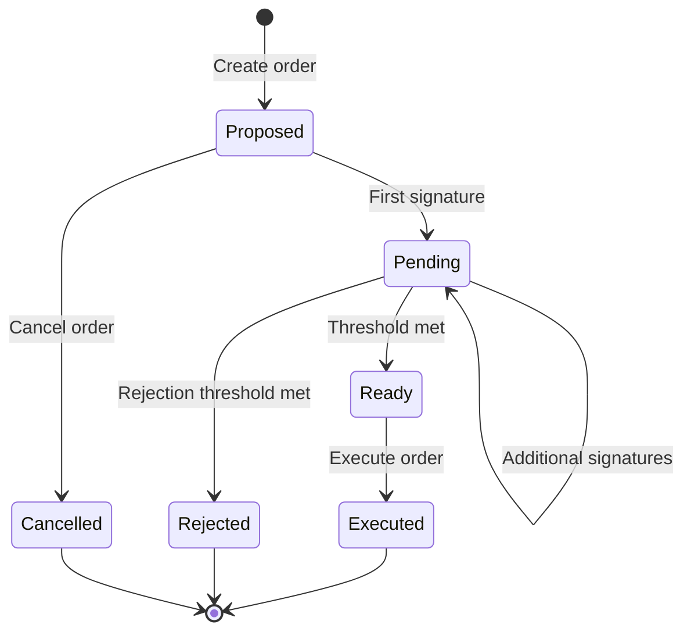

## Prerequisites

Orders require an unlocked wallet-password session and `userRef` on sign/execute (or `runWithUserRef`):

```typescript
const userRef = await sdk.getSdkUserId();
await sdk.unlockWalletSession(userRef, password);

const { order } = await sdk.createOrder({
  chain: EChainType.EVM,
  multisigId: multisig.id,
  walletAddress: myWalletAddress,
  method: 'native',
  instructions: [{ to: recipientAddress, amount: '0.5' }],
  walletScope: 'personal', // or 'organization'
});
```

## Overview

**Orders** are proposed transactions for multisig wallets. They require approval from a threshold number of owners before execution. This ensures shared custody and prevents single points of failure.

## Order Lifecycle



## Order Statuses

| Status      | Description                                   |
| ----------- | --------------------------------------------- |
| `proposed`  | Order created, awaiting first signature       |
| `pending`   | At least one signature, but threshold not met |
| `ready`     | Threshold met, ready for execution            |
| `executed`  | Successfully executed on-chain                |
| `rejected`  | Rejected by owners                            |
| `failed`    | Execution failed                              |
| `cancelled` | Cancelled before execution                    |

## Order Types

| Method                    | Description                               |
| ------------------------- | ----------------------------------------- |
| `native`                  | Send native currency (ETH, SOL, TRX, BTC) |
| `erc20` / `spl` / `trc20` | Send tokens                               |
| `addOwner`                | Add a new owner to multisig               |
| `removeOwner`             | Remove an owner from multisig             |
| `changeThreshold`         | Change signature threshold                |

## Creating Orders

### Send Native Currency

```typescript
const order = await sdk.createOrder({
  chain: 'EVM',
  multisigId: multisig.id,
  walletAddress: myWalletAddress,
  method: 'native',
  instructions: [
    {
      to: recipientAddress,
      amount: '0.5', // ETH
    },
  ],
});

console.log('Order created:', order.order.id);
console.log('Status:', order.order.status); // 'proposed'
```

### Send Tokens

```typescript
const order = await sdk.createOrder({
  chain: 'EVM',
  multisigId: multisig.id,
  walletAddress: myWalletAddress,
  method: 'erc20',
  instructions: [
    {
      to: recipientAddress,
      amount: '100',
      tokenAddress: '0xA0b8...',
      decimals: 6,
    },
  ],
  token: {
    address: '0xA0b8...',
    symbol: 'USDC',
    decimals: 6,
  },
});
```

### Simplified Send Order

```typescript
const order = await sdk.createSendOrder({
  multisigId: multisig.id,
  walletAddress: myWalletAddress,
  to: recipientAddress,
  amount: '0.5',
  chainId: '1', // Ethereum mainnet
  // token is optional - omit for native currency
});
```

### Change Multisig Settings

```typescript
// Add owner
const order = await sdk.createSettingsOrder({
  multisigId: multisig.id,
  multisig: multisig,
  walletAddress: myWalletAddress,
  newOwners: [...multisig.owners.map(o => o.walletAddress), '0x4444...'],
});

// Remove owner
const order = await sdk.createSettingsOrder({
  multisigId: multisig.id,
  multisig: multisig,
  walletAddress: myWalletAddress,
  newOwners: multisig.owners.map(o => o.walletAddress).filter(addr => addr !== '0x1111...'),
});

// Change threshold
const order = await sdk.createSettingsOrder({
  multisigId: multisig.id,
  multisig: multisig,
  walletAddress: myWalletAddress,
  newOwners: multisig.owners.map(o => o.walletAddress),
  newThreshold: 3,
});
```

## Signing Orders

Each owner signs the order (shares are automatically fetched):

```typescript
const userRef = await sdk.getSdkUserId();

const result = await sdk.signOrder({
  chain: EChainType.EVM,
  order: order.order, // Order object
  walletAddress: myWalletAddress,
  multisigId: multisig.id,
  userRef,
});

console.log('Signed:', result.order.id);
console.log('Signatures:', result.order.signatures.length);
console.log('Threshold:', multisig.threshold);

// Check if threshold is met
if (result.order.signatures.length >= parseInt(multisig.threshold)) {
  console.log('Ready to execute!');
}
```

## Executing Orders

Once threshold is met, any owner can execute:

```typescript
const userRef = await sdk.getSdkUserId();

const result = await sdk.executeOrder({
  chain: EChainType.EVM,
  order: order.order, // Order object
  multisig: multisig,
  walletAddress: myWalletAddress,
  userRef,
});

console.log('Executed!');
console.log('Transaction hash:', result.txHash);
console.log('Status:', result.order.status); // 'executed'
```

### Fee Estimation Before Execution

```typescript
const fee = await sdk.estimateOrderExecutionFee({
  chain: 'EVM',
  orderId: order.order.id,
  walletAddress: myWalletAddress,
  chainId: '1', // ChainIdValue as string
});

console.log('Execution fee:', fee.estimatedFee, fee.currency);
```

## Rejecting Orders

Owners can reject orders they don't approve:

```typescript
const userRef = await sdk.getSdkUserId();

const result = await sdk.rejectOrder({
  chain: EChainType.EVM,
  order: order.order, // Order object
  multisig: multisig,
  walletAddress: myWalletAddress,
  userRef,
});

console.log('Rejected');
console.log('Order status:', result.status); // 'rejected'
```

<Info>
  If rejection threshold is met (usually `owners - threshold + 1`), the order is fully rejected and
  cannot be executed.
</Info>

## Getting Orders

### List Orders

```typescript
const orders = await sdk.getOrders({
  chain: 'EVM',
  multisigId: multisig.id,
  page: 1,
  limit: 20,
});

orders.orders.forEach(order => {
  console.log(`${order.id}: ${order.method} - ${order.status}`);
});
```

### Get Single Order

```typescript
const { order } = await sdk.getOrderById({
  chain: 'EVM',
  orderId: 'uuid',
});

console.log(order);
// {
//   id: 'uuid',
//   multisigId: 'multisig-uuid',
//   method: 'native',
//   status: 'pending',
//   walletInitiator: '0x1111...',
//   signatures: [{ walletAddress: '0x1111...', signedHash: '...' }],
//   txHash: null
// }
```

## Complete Flow Example

```typescript
// 1. Create order
const { order: createdOrder } = await sdk.createOrder({
  chain: 'EVM',
  multisigId: multisig.id,
  walletAddress: owner1Address,
  method: 'native',
  instructions: [{ to: recipient, amount: '1.0' }],
});

// 2. Owner 1 signs (if not auto-signed)
const signed1 = await sdk.signOrder({
  chain: 'EVM',
  order: createdOrder,
  walletAddress: owner1Address,
});

// 3. Owner 2 signs
const signed2 = await sdk.signOrder({
  chain: 'EVM',
  order: createdOrder,
  walletAddress: owner2Address,
});

// 4. Check threshold
if (signed2.order.signatures.length >= parseInt(multisig.threshold)) {
  // 5. Execute
  const executed = await sdk.executeOrder({
    chain: 'EVM',
    order: signed2.order,
    multisig: multisig,
    walletAddress: owner2Address,
  });

  console.log('Done! TX:', executed.txHash);
}
```

## Chain-Specific Notes

<AccordionGroup>
  <Accordion title="EVM">
    - Orders create Safe transaction hashes
    - Signatures use EIP-712 typed data
    - Any owner can execute after threshold
    - Gas paid by executor
  </Accordion>
  
  <Accordion title="Solana">
    - Uses Squads Multisig proposals
    - Orders have transaction indices
    - Activation step required after creation
    - Uses proposal PDA for tracking
  </Accordion>
  
  <Accordion title="Bitcoin">
    - Uses PSBTs (Partially Signed Bitcoin Transactions)
    - Each signature is added to the PSBT
    - Transaction broadcast after threshold signatures
  </Accordion>
  
  <Accordion title="Tron">
    - Native transaction signing
    - Signatures collected off-chain
    - Transaction assembled and broadcast on execution
  </Accordion>

{' '}

<Accordion title="Cardano">
  - Uses EUTXO model with UTXO reservation - 72-hour TTL for all transactions - Signatures collected
  as witnesses - Broadcast via Blockfrost
</Accordion>

{' '}

{' '}
<Accordion title="XRP">
  - Supports Payment and other transaction types - Sequential execution based on account sequence -
  24-hour expiration based on ledger sequence - Signatures collected off-chain
</Accordion>

</AccordionGroup>
